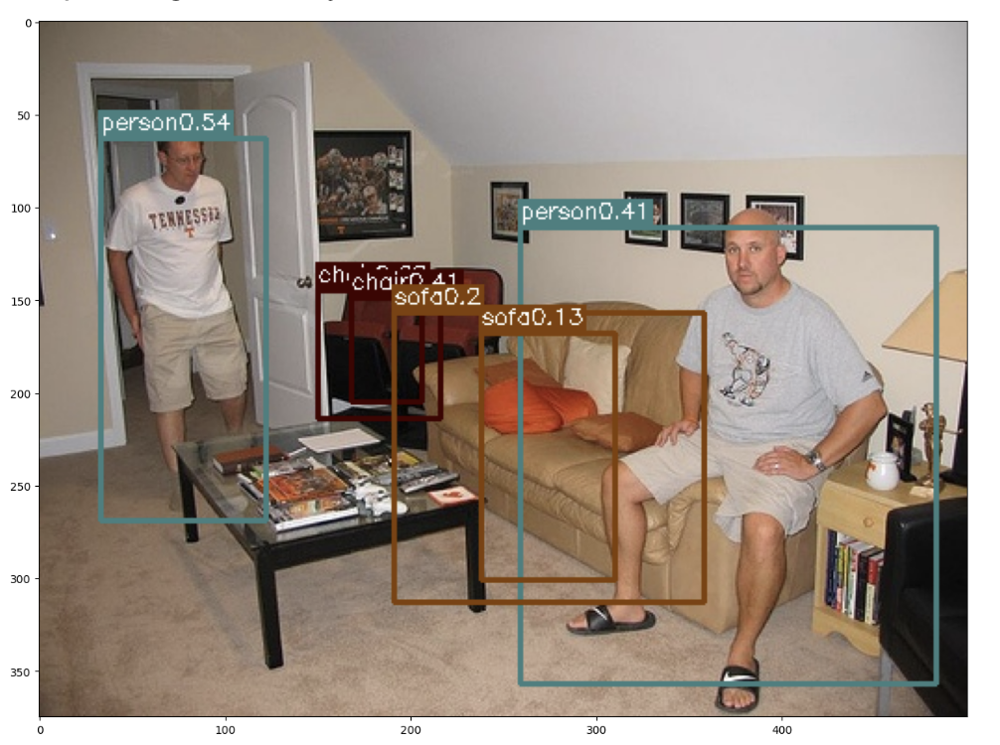
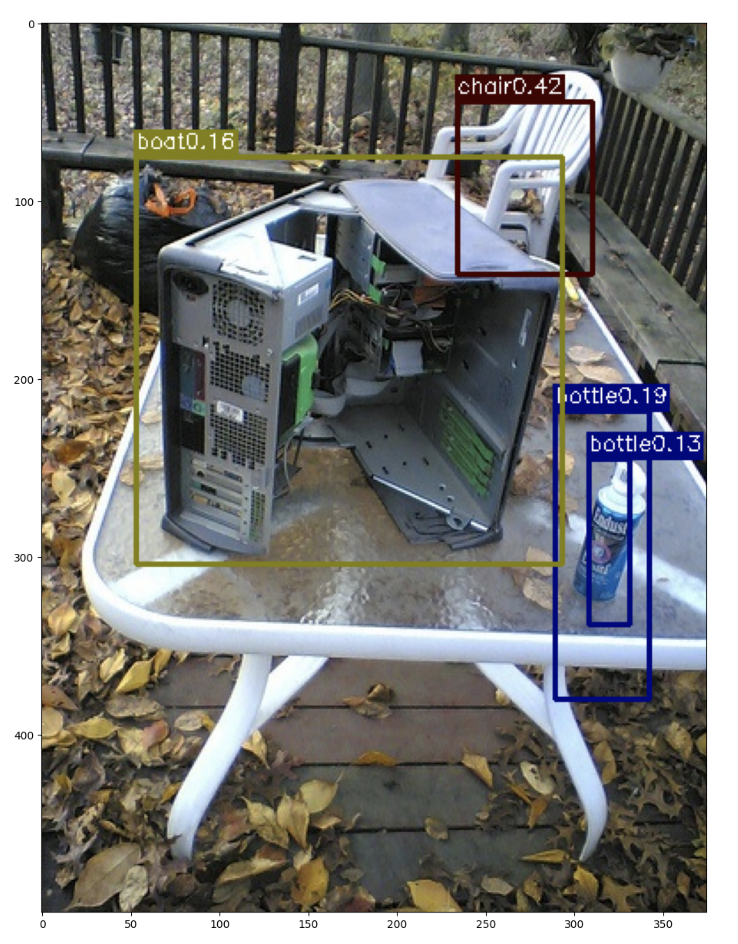

# YOLO
This project implements object detection using the YOLO (You Only Look Once) algorithm on the PASCAL VOC 2007 dataset. YOLO is a state-of-the-art, real-time object detection system that is fast and accurate. This repository contains the code to train, evaluate, and deploy a YOLO model for detecting objects in images and videos.

# Evaluation
* Best mAP value on Kaggle = 0.5444
* Final loss = 1.245

# References
* YOLO Original Paper: https://pjreddie.com/media/files/papers/yolo_1.pdf
* YOLO website: http://pjreddie.com/yolo/
* Dataset: http://host.robots.ox.ac.uk/pascal/VOC/voc2007/
